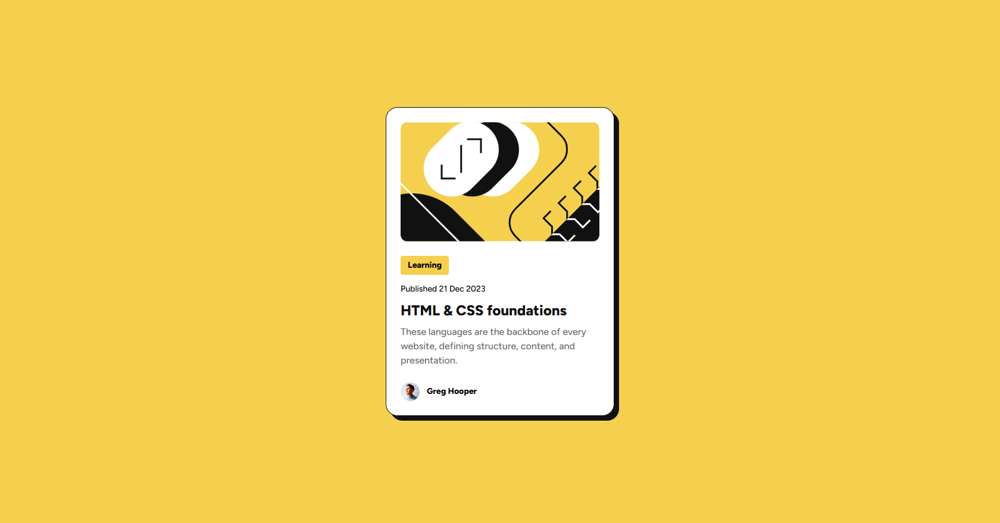

# Frontend Mentor - Blog preview card solution

This is a solution to the [Blog preview card challenge on Frontend Mentor](https://www.frontendmentor.io/challenges/blog-preview-card-ckPaj01IcS). Frontend Mentor challenges help you improve your coding skills by building realistic projects. 

## Screenshot

## Built with

- Semantic HTML5 markup
- CSS custom properties
- Flexbox
- Mobile-first workflow

## Links

- [Solution page](https://www.frontendmentor.io/solutions/blog-preview-card-using-flexbox-J-HEjwzQSH)
- [Live site](https://risaysky.github.io/Frontend-Mentor-Blog-preview-card/)

